# Generative Modeling

## Software setup

Please use Python 3.8.

Please run `pip install -r requirements.txt` to install the necessary dependencies for this homework.

## Setup 

Please follow these directions exactly!

```
cd gan/
mkdir datasets/
gdown https://drive.google.com/uc\?id\=1hbzc_P1FuxMkcabkgn9ZKinBwW683j45 -O datasets/
tar zxvf datasets/CUB_200_2011.tgz
mv CUB_200_2011/ datasets/
python resize_dataset.py --input_folder datasets/CUB_200_2011/images --output_folder datasets/CUB_200_2011_32/ --res 32
rm -rf datasets/cub.tgz
rm -rf datasets/CUB_200_2011_32/Mallard_0130_76836.jpg datasets/CUB_200_2011_32/Brewer_Blackbird_0028_2682.jpg datasets/CUB_200_2011_32/Clark_Nutcracker_0020_85099.jpg datasets/CUB_200_2011_32/Ivory_Gull_0040_49180.jpg datasets/CUB_200_2011_32/Pelagic_Cormorant_0022_23802.jpg datasets/CUB_200_2011_32/Western_Gull_0002_54825.jpg datasets/CUB_200_2011_32/Ivory_Gull_0085_49456.jpg datasets/CUB_200_2011_32/White_Necked_Raven_0070_102645.jpg
cp cub_clean_custom_na.npz /path/to/python_env/lib/python3.8/site-packages/cleanfid/stats/cub_clean_custom_na.npz
```

## Generative Adversarial Networks

We will be training our GANs on the CUB 2011 Dataset (http://www.vision.caltech.edu/visipedia/CUB-200-2011.html). This dataset contains 11,708 images
of close up shots of different bird species in various environments. Our models will be trained to generate realistic looking samples of these birds.
Due to compute considerations for the course, we will be using a downsampled version of the dataset at a 32x32 resolution.

### Vanilla GAN

#### Analysis


 | Vanilla GAN                | Results                                                                           | Comments                                                                                                                                                  |
|----------------------------|-----------------------------------------------------------------------------------|-----------------------------------------------------------------------------------------------------------------------------------------------------------|
| FID                        |                            | FID = 173                                                                                                                                                 | 
| Samples                    | iter 18000:<br/>iter 30000:<br/> | The final samples are poor quality and blurry, albeit with some resemblance to birds in terms of shape and color when the FID is lowest at around 18000 iterations |
| Latent space interpolation |                                         | The latent space is not well disentangled and it's hard to tell if a specific feaature is changing in any of the two directions                           |

It is hard to optimize vanilla GAN because of how the optimization is setup as a min-max game. This leads to an inherently 
unstable training in the search of a Nash equilibrium and causes divergence. This is evident from the rather frequent
fluctuations in the FID plot. The cross-entropy loss results in a JS divergence minimization which can lead to a vanishing gradient 
problem. The generator can also sometimes find incentive in oscillating between different modes to fool the discriminator instead
of improving the overall quality and diversity of the generated outputs. This is because the log-loss is agnostic to the distance 
of the fake examples to real examples as long as they are classified correctly. 


<div class="pagebreak"> </div>

### LS-GAN

#### Analysis


 | LS-GAN                       |Results| Comments                                                                                                                                     |
|----------------------------|----|----------------------------------------------------------------------------------------------------------------------------------------------|
| FID                        | | FID = 78                                                                                                                                      | 
| Samples                    || The samples look better than samples from vanilla GAN, they capture typical shapes and colours of bird better and are relatively less blurry |
| Latent space interpolation || The latent space looks more disentangled than vanilla GAN                                                                                    |

Using an L2 loss objective instead of log loss helps alleviates the problem of mode collapse (or oscillation) because
it penalizes the network based on distance between the fake and the real samples. This is intuitively equivalent to replacing
learning a critic (that only cares about whether the samples look real or not) with learning a loss function and helps produce penalty (gradients) 
proportional to distance. 

<div class="pagebreak"> </div>

### WGAN-GP 

#### Analysis


 | WGAN-GP                     |Results| Comments                                                                                                  <br/><br/> <br/><br/> |
|----------------------------|----|---------------------------------------------------------------------------------------------------------------------------------|
| FID                        || FID = 46                                                                                                                         | 
| Samples                    || The samples are higher quality and resemble birds more closely than the previous two GANs                                       |
| Latent space interpolation || The latent space looks even more distangled than LSGAN                                                                          |

WGANs use Wasserstein distance (EM distance) instead of JS Divergnce. WGAN-GP enforces 1-Lipschitz contraint on the discriminator via a gradient 
penalty 
term. 
This helps the GAN learn a 
smoother decision boundary and mitigates the problem vanishing gradients faced with JS divergence-based loss
functions. This enables learning a discriminator that can distinguish between model samples and true data samples from an
expectation perspective as opposed to a ratio perspective. 

<div class="pagebreak"> </div>

## Variational Autoencoders

We will be training AutoEncoders and VAEs on the CIFAR10 dataset.

### AutoEncoder

#### Running the auto-encoder

|Loss|
|----|
|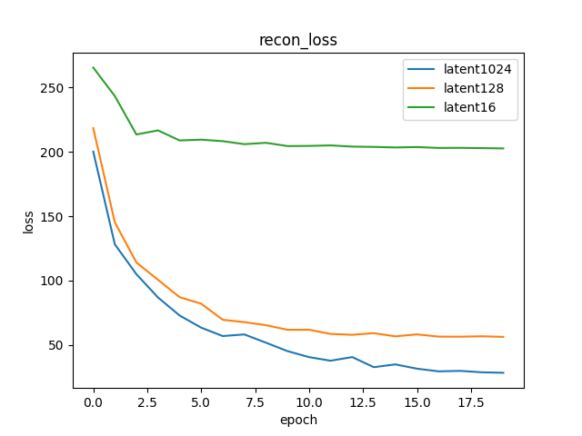|

| AutoEncoder | Reconstructions|
|-------------------------------------------------|-----|
| Latent 16                                       |    |
| Latent 128                                        | 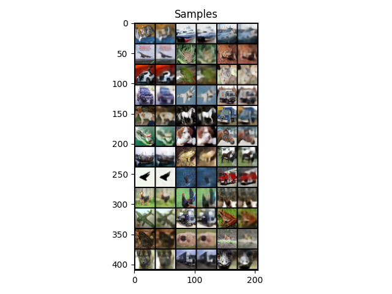  |
 | Latent 1024 | 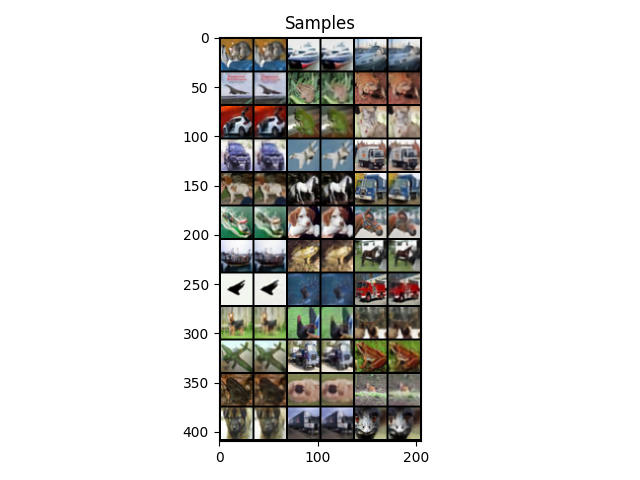 |


VAE with 1024 latent dimensions performs the best as the bottleneck has greater capacity to capture different attributes of the
image distribution. With just 16 latent dimensions, the subspace is too low-dimensional to preserve enough information
for a reasonable reconstruction and hence the samples are very blurry.

<div class="pagebreak"> </div>

### Variational Auto-Encoder


#### Running the VAE

| Reconstruction Loss                        | KL Loss|
|--------------------------------------------|----|
| 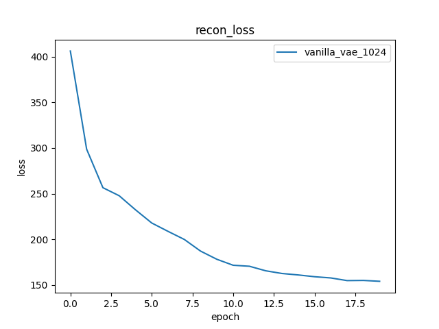 | 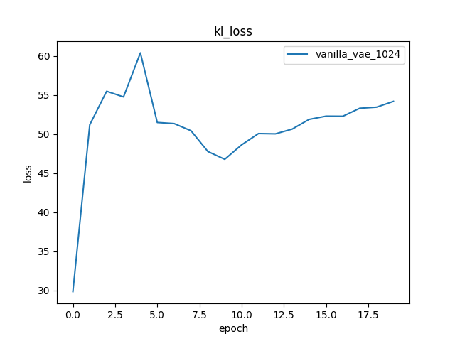|

| Vanilla VAE              | Results|
|--------------------------|----|
| Epoch 19 Samples         |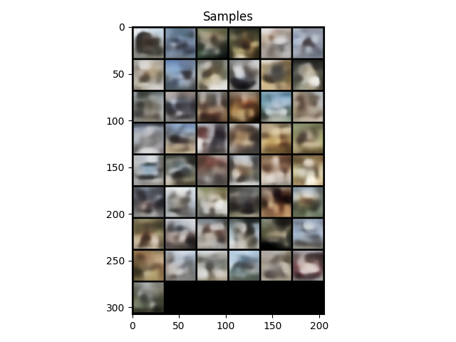|
| Epoch 19 Reconstructions ||


<div class="pagebreak"> </div>

###  Beta Variational Auto-Encoder

#### Tuning beta


| Reconstruction Loss                        | KL Loss|
|--------------------------------------------|----|
|  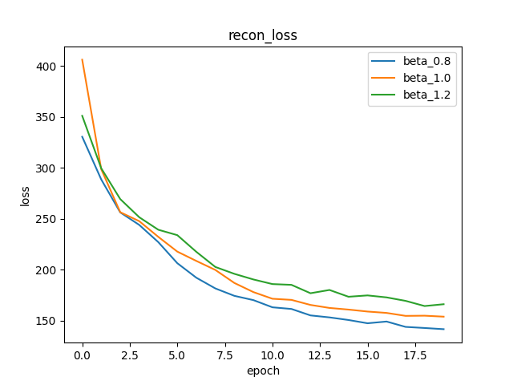| 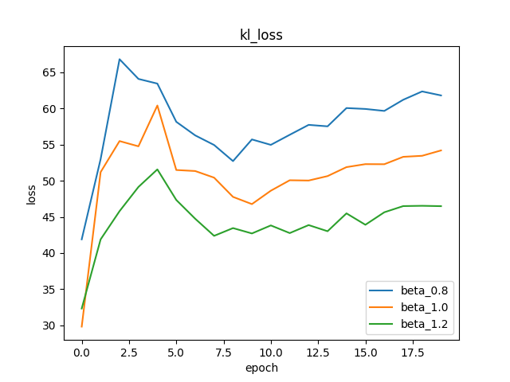|

- The reconstruction loss increases as beta increases
- The KL loss decreases as beta increases
- The samples for all beta values are blurry but it seems object boundaries become slightly more pronounced with higher beta values
- For beta = 0, VAE turns into an autoencoder. 

| beta-VAE                  | beta=0.8         | 
|-------------------------|----|
| epoch 19 samples        | 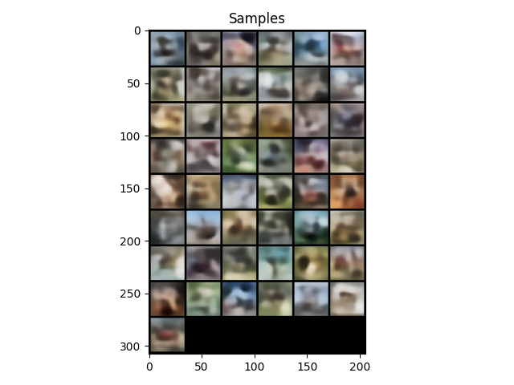 |
| epoch 19 reconstruction | 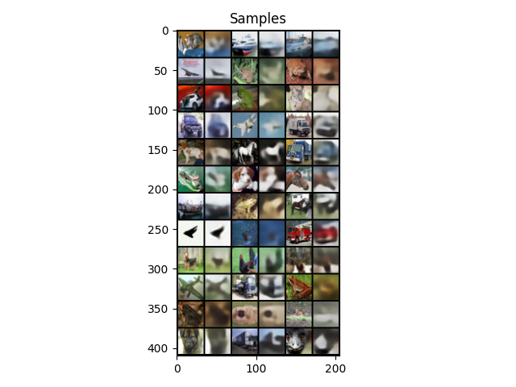 | 

| beta-VAE                  | beta=1|
|-------------------------|----|
| epoch 19 samples        |  |
| epoch 19 reconstruction | |


| beta-VAE                  | beta=1.2                                           |
|-------------------------|---------------------------------------------------|
| epoch 19 samples        | 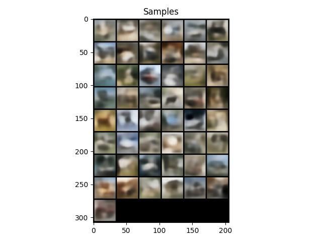 |
| epoch 19 reconstruction | 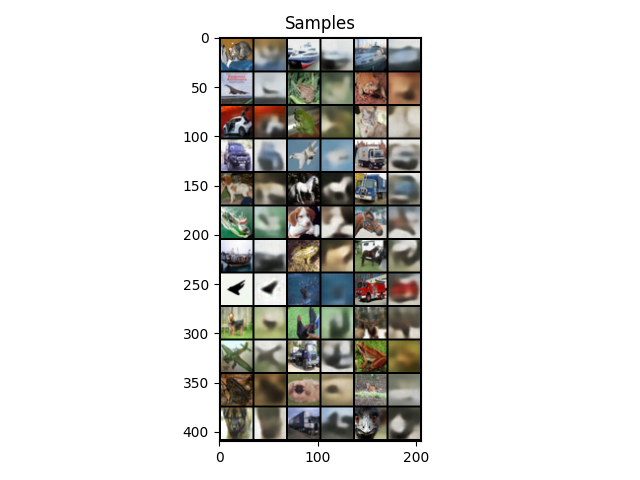 |


#### Linear schedule for beta

While the generated samples and reconstructions are still blurry, the objects in the image have sharper boundaries 
than vanilla VAE. 

| Reconstruction Loss                        | KL Loss |
|--------------------------------------------|---------|
| 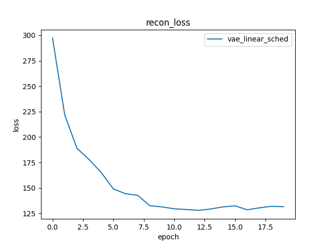|    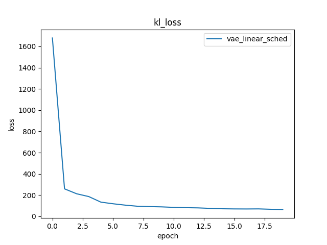     |

| Epoch 19 samples | 
|---|
|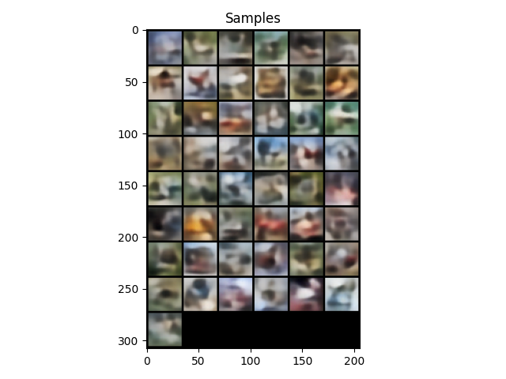|


| Epoch 19 Reconstructions                                      |
|---------------------------------------------------------------|
 | 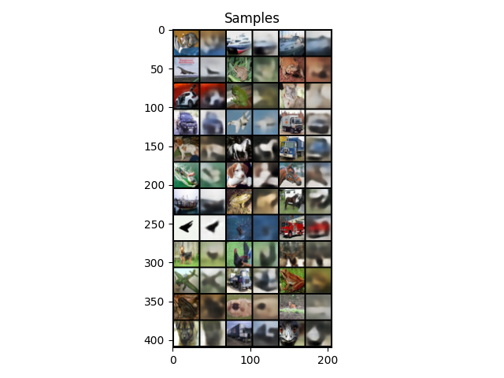 |


